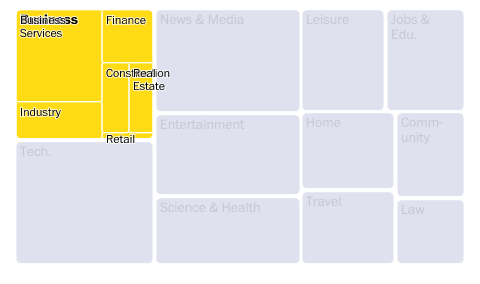
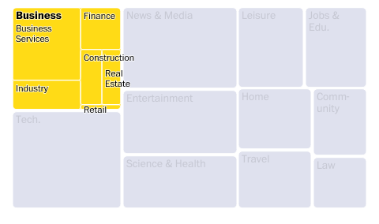
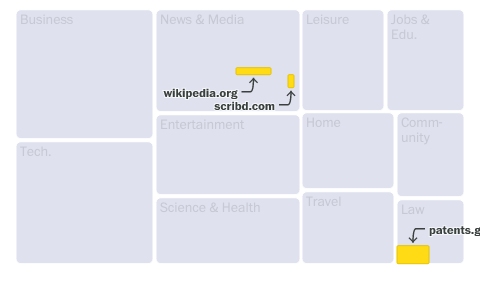
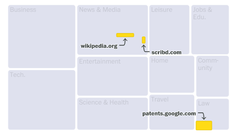

# avoid-overlap

Avoid text overlaps in your charts and data visualizations (automatic label placement). Uses [simulated annealing](https://en.wikipedia.org/wiki/Simulated_annealing) to quickly find an acceptable solution.

The utilities were build with [D3.js](https://github.com/d3/d3) and [React](https://react.dev/) in mind but likely work with other frameworks.

## Two techniques to avoid overlaps: Nudge and Choices

Labeling charts, maps and other graphics is more art than science, but there are some general rules we can follow to achieve good results programmatically. This library provides two label-avoidance techniques: `nudge` and `choices`.

### Nudge

The `nudge` technique resolves overlaps by simply nudging labels away from each other until they no longer collide. You can limit the nudging to specific directions and distances. This technique works well if the thing you’re labeling is an area rather than a specific point.

The following images, from [a Washington Post graphic](https://www.washingtonpost.com/technology/interactive/2023/ai-chatbot-learning/), demonstrate the `nudge` technique. The labels were passed to `avoid-overlap`, specifying that nudging the labels either down or to the right would work.

| Before                                                       | After                                                                                                  |
| ------------------------------------------------------------ | ------------------------------------------------------------------------------------------------------ |
|  |  |

### Choices

The `choices` technique resolves overlaps by trying a series of positions provided by the user until it finds a combination that works. This technique works well if some number of different positions might work, for example if you are using a leader line or arrow.

In the following example, the labels were passed to `avoid-overlap` with a list of functions that could draw the label and an arrow in different positions: to the top left, top middle, top right, bottom left, bottom middle and bottom right. The library tries these positions until it finds a combination that works.

| Before                                                         | After                                                                                                                                        |
| -------------------------------------------------------------- | -------------------------------------------------------------------------------------------------------------------------------------------- |
|  |  |

## Installation

```bash
npm install --save avoid-overlap
```

## Usage

```js
import { avoidOverlap } from 'avoid-overlap';

// Place your labels here

// Then, run avoid-overlap
avoidOverlap(/* args here, see table below */);
```

### `avoidOverlap(labelGroups, options)`

Perform the label avoidance. Call this after you have positioned all of your labels. The parent element is inferred automatically as the deepest common ancestor of all label nodes.

<!-- params-start -->

| Param | Type | Description |
| - | - | - |
| `labelGroups` | `object[]` | An array of label groups that define how to resolve overlaps. |
| `labelGroups[].technique` | `"nudge" \| "choices" \| "fixed"` | The overlap avoidance technique to use. `nudge` shifts labels by a small offset; `choices` picks from a list of candidate positions; `fixed` treats nodes as immovable obstacles. |
| `labelGroups[].nodes` | `Element[]` | An array of elements to avoid overlaps. |
| `labelGroups[].margin` | `number` \| `object` | Extra spacing to consider for collisions with these nodes. Accepts a number (uniform) or `{ top, right, bottom, left }`. Default: `0` |
| `labelGroups[].priority` | `number` | Priority for this label group. Higher-priority labels are kept visible when a conflict cannot be resolved. Uses quadratic weighting, so differences matter more at higher values. Default: `0` |
| `labelGroups[].remove` | `boolean` | Whether the algorithm is allowed to hide this label when it cannot be placed without overlapping a higher-priority label. Set to `false` to always show the label, even if it overlaps. Default: `true` |
| `labelGroups[].onRemove` | `function` | Called when a node is removed from the DOM due to an unresolvable overlap. |
| `labelGroups[].render` | `function` | _nudge only_. Function that applies the nudged position (`dx`, `dy`) to the node. |
| `labelGroups[].directions` | `"up"` \| `"down"` \| `"left"` \| `"right"` | _nudge only_. Which directions to consider nudging. Default: `["down", "right", "up", "left"]` |
| `labelGroups[].maxDistance` | `number` | _nudge only_. Maximum nudge distance in pixels. Default: `64` |
| `labelGroups[].choices` | `function[]` | _choices only_. An array of functions that each apply a candidate position to the node. Pass an empty array to treat the node as a fixed obstacle. |
| `labelGroups[].choiceBonuses` | `number[]` | _choices only_. Score bonus for each choice, parallel to `choices`. Positive values make a choice more attractive; negative values less so. When omitted, a small penalty (`-0.5`) is applied to non-zero choices. |
| | | |
| `options.includeParent` | `boolean` | Whether to treat the common ancestor's edges as collision boundaries. Default: `true` |
| `options.parentMargin` | `number` \| `object` | Margin inset from the parent boundary. Negative values allow labels to touch (but not cross) the parent edge without a collision penalty. Accepts a number (uniform) or per-side object. Default: `-2` |
| `options.iterations` | `number` | Number of simulated-annealing iterations. More iterations = better results but slower. Default: `10000` |
| `options.temperature` | `number` | Initial temperature for simulated annealing. Higher values allow the algorithm to escape local optima early on. Most users won't need to change this. Default: `100` |
| `options.coolingRate` | `number` | Multiplicative cooling rate per iteration (between 0 and 1). Values close to 1 cool slowly; values closer to 0 cool fast. Most users won't need to change this. Default: `0.995` |
| `options.scoreExponent` | `number` | Exponent used in the per-label score formula: `(priority + 1) ^ scoreExponent`. Higher values make the highest-priority labels exponentially more valuable. Default: `2` |
| `options.seed` | `string` \| `number` | Seed for the random number generator. The same seed produces identical placements across runs. Default: `42` |
| `options.debug` | `boolean` | Whether to enable debug mode, which renders a panel showing label scores and lets you toggle between the original and final layouts. Default: `false` |

<!-- params-end -->

### Example using technique: `nudge`

```js
import { avoidOverlap } from 'avoid-overlap';
import { select, selectAll } from 'd3-selection';

const headers = selectAll('.label-header');
const subheads = selectAll('.label-subhead');

avoidOverlap([
  {
    technique: 'nudge',
    nodes: headers.nodes(),
    render: () => {},
    priority: 1,
  },
  {
    technique: 'nudge',
    nodes: subheads.nodes(),
    priority: 2,
    render: (node, dx, dy) => {
      // Apply the nudge to the node
      const selected = select(node);
      const [x, y] = selected
        .attr('transform')
        .match(/([0-9\-\.]+)/g)
        .map((d) => +d);

      select(node).attr('transform', `translate(${x + dx}, ${y + dy})`);
    },
  },
]);
```

### Example using technique: `choices`

```js
import { avoidOverlap } from 'avoid-overlap';
import { selectAll } from 'd3-selection';

const arrows = selectAll('.label-arrow');

const arrowTop = (node) => {
  /* Draw the arrow at the top */
};
const arrowBottom = (node) => {
  /* Draw the arrow at the bottom */
};

avoidOverlap([
  {
    technique: 'choices',
    nodes: arrows.nodes(),
    choices: [arrowTop, arrowBottom],
    priority: 1,
  },
]);
```

### Debugging

Setting `debug: true` in options renders a panel at the top of the page showing each label's technique, priority, score, and chosen position. Buttons let you toggle between the original and final layouts to see what the algorithm changed.

## Development

```bash
npm run dev
```

Development should happen on feature branches, which should be PR-ed into the main branch.

Releasing happens using the [release-please](https://github.com/marketplace/actions/release-please-action) GitHub action. The action handles versioning, changelogs and publishing the package to npm.
