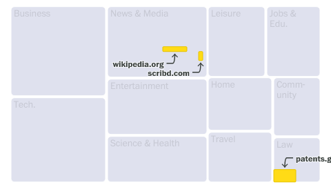

# avoid-overlap

Utilities for chart-makers to avoid text overlaps in their graphics. The utilities were build with [D3.js](https://github.com/d3/d3) and [React](https://react.dev/) in mind but likely work with other frameworks.

## Two techniques to avoid overlaps: Nudge and Choices

Labeling charts, maps and other graphics is more art than science, but there are some general rules we can follow to achieve good results programmatically. This library provides two label-avoidance techniques: `nudge` and `choices`.

### Nudge

The `nudge` technique resolves overlaps by simply nudging labels away from each other until they no longer collide. You can limit the nudging to specific directions and distances. This technique works well if the thing you’re labeling is an area rather than a specific point.

The following images, from [a Washington Post graphic](https://www.washingtonpost.com/technology/interactive/2023/ai-chatbot-learning/), demonstrate the `nudge` technique. The labels were passed to `avoid-overlap`, specifying that nudging the labels either down or to the right would work.

| Before                                                       | After                                                                                                  |
| ------------------------------------------------------------ | ------------------------------------------------------------------------------------------------------ |
|  |  |

### Choices

The `choices` technique resolves overlaps by trying a series of positions provided by the user until it finds a combination that works. This technique works well if some number of different positions might work, for example if you are using a leader line or arrow.

In the following example, the labels were passed to `avoid-overlap` with a list of functions that could draw the label and an arrow in different positions: to the top left, top middle, top right, bottom left, bottom middle and bottom right. The library tries these positions until it finds a combination that works.

| Before                                                         | After                                                                                                                                        |
| -------------------------------------------------------------- | -------------------------------------------------------------------------------------------------------------------------------------------- |
|  |  |

## Installation

```bash
npm install --save avoid-overlap
```

## Usage

This library provides the class `AvoidOverlap`, which provides the function `.run()`. Each page should use just one `AvoidOverlap` instance.

```js
import { AvoidOverlap } from 'avoid-overlap';

// Create an avoid-overlap instance
const avoidOverlap = new AvoidOverlap();

// Place your labels here

// Then, run the avoid overlapper
avoidOverlap.run(/* args here, see table below */);
```

### `AvoidOverlap.run(parent, labelGroups, options)`

Perform the label avoidance.

Call this after you have positioned all of your labels.

| Param                         | Type                                | Default                                    | Description                                                                                                                                                                                                                                                                                                               |
| ----------------------------- | ----------------------------------- | ------------------------------------------ | ------------------------------------------------------------------------------------------------------------------------------------------------------------------------------------------------------------------------------------------------------------------------------------------------------------------------- |
| parent                        | `Element`                           |                                            | The parent element, that contains all labels. This can be a `div`, an `svg`, etc.                                                                                                                                                                                                                                         |
| labelGroups                   | `object[]`                          |                                            | An array of label groups that define how to resolve overlaps                                                                                                                                                                                                                                                              |
| labelGroups[].technique       | `string`                            |                                            | The overlap avoidance technique to use ("nudge" or "choices")                                                                                                                                                                                                                                                             |
| labelGroups[].nodes           | `Element[]`                         |                                            | An array of elements to avoid overlaps                                                                                                                                                                                                                                                                                    |
| labelGroups[].margin          | `object`                            | `{ top: 0, right: 0, bottom: 0, left: 0 }` | How much extra spacing to consider for collisions with these nodes                                                                                                                                                                                                                                                        |
| labelGroups[].priority        | `number`                            |                                            | What priority to give this label group in case of collision. Generally nodes with lower priority values will not be moved if they collide with nodes with higher priority values. Note that 1 is a lower priority value than 10.                                                                                          |
| labelGroups[].render          | `function(node, dx, dy)`            |                                            | Function that applies the given nudged position (`dx`, `dy`) to the `node`. Required for technique `nudge`.                                                                                                                                                                                                               |
| labelGroups[].nudgeStrategy   | `string`                            | `"shortest"`                               | Strategy to choose which direction to nudge toward. `"shortest"` will nudge in the direction requiring the least movement, while `"ordered"` will use the first direction that works as specified in `labelGroups[].nudgeDirections`. Optional for technique `nudge`.                                                     |
| labelGroups[].nudgeDirections | `string[]`                          | `["down", "right", "up", "left"]`          | Which directions to consider nudging. Optional for technique `nudge`.                                                                                                                                                                                                                                                     |
| labelGroups[].choices         | `function(node)[]`                  |                                            | An array of functions that apply a new potential positioning for the `node`. Each choice will be tried in order until a solution is found. Required for technique `choices`.                                                                                                                                              |
| options                       | `object`                            |                                            | Global options                                                                                                                                                                                                                                                                                                            |
| [options.includeParent]       | `boolean`                           | `false`                                    | Whether to consider the parent as part of the bounds                                                                                                                                                                                                                                                                      |
| [options.parentMargin]        | `object`                            | `{ top: 0, right: 0, bottom: 0, left: 0 }` | How much extra spacing to consider for collisions with the parent                                                                                                                                                                                                                                                         |
| [options.maxAttempts]         | `number`                            | 3                                          | How many iterations to try finding collisions before giving up                                                                                                                                                                                                                                                            |
| [options.debug]               | `boolean`                           | `false`                                    | Whether to enable debug mode, which logs all nodes in the system and calls `[options.debugFunc]` to visually aid in debugging                                                                                                                                                                                             |
| [options.debugFunc]           | `function(tree, parentBounds, uid)` | `defaultDebugFunc`                         | The default debug function, which draws boxes for each label for each position in its history saved as the overlap avoider ran. `tree` is an `RBush` object containing all nodes in the system. `parentBounds` contains the bounding box of the parent. `uid` is a unique identifier for this instance of `AvoidOverlap`. |

### Example using technique: `nudge`

```js
import { AvoidOverlap } from 'avoid-overlap';
import { select, selectAll } from 'd3-selection';

const parent = select('.chart');
const headers = selectAll('.label-header');
const subheads = selectAll('.label-subhead');

const avoidOverlap = new AvoidOverlap();

avoidOverlap.run(
  parent,
  [
    {
      technique: 'nudge',
      nodes: headers.nodes(),
      render: () => {},
      priority: 1,
    },
    {
      technique: 'nudge',
      nodes: subheads.nodes(),
      priority: 2,
      render: (node, dx, dy) => {
        // Apply the nudge to the node
        const selected = select(node);
        const [x, y] = selected
          .attr('transform')
          .match(/([0-9]+)/g)
          .map((d) => +d);

        select(node).attr('transform', `translate(${x + dx}, ${y + dy})`);
      },
    },
  ],
  {
    includeParent: true,
  }
);
```

### Example using technique: `choices`

```js
import { avoidOverlap } from 'avoid-overlap';
import { select, selectAll } from 'd3-selection';

const parent = select('.chart');
const arrows = selectAll('.label-arrow');

const arrowTop = (node) => {
  /* Draw the arrow at the top */
};
const arrowBottom = (node) => {
  /* Draw the arrow at the bottom */
};

const avoidOverlap = new AvoidOverlap();
avoidOverlap.run(
  parent,
  [
    {
      technique: 'choices',
      nodes: headers.nodes(),
      choices: [arrowTop, arrowBottom],
      priority: 1,
    },
  ],
  {
    includeParent: true,
  }
);
```

### Debugging

Debugging needs to be improved. But for now the `debug` option may help. Setting that to `true` will do two things.

First it will draw colorful boxes around the labels that the system is avoiding overlaps among. Each label will have a box drawn for each position it tried. It’s not great, but it’s something.

Second it will `console.log()` a representation of all nodes in the system. You can copy that output into the `exportedArgs` control [on this Storybook page](https://main--64a5bef463fbc133b9a4b6b6.chromatic.com/?path=/story/utils-real-world-exported-tests--no-overlap) to see it render there, or into the stories in [test/real-world-exports.stories.ts](test/real-world-exports.stories.ts) if you are running this repo locally.

## Development

```bash
npm run dev
```

Development should happen on feature branches, which should be PR-ed into the main branch.

Releasing happens using the [release-please](https://github.com/marketplace/actions/release-please-action) GitHub action. The action handles versioning, changelogs and publishing the package to npm.
